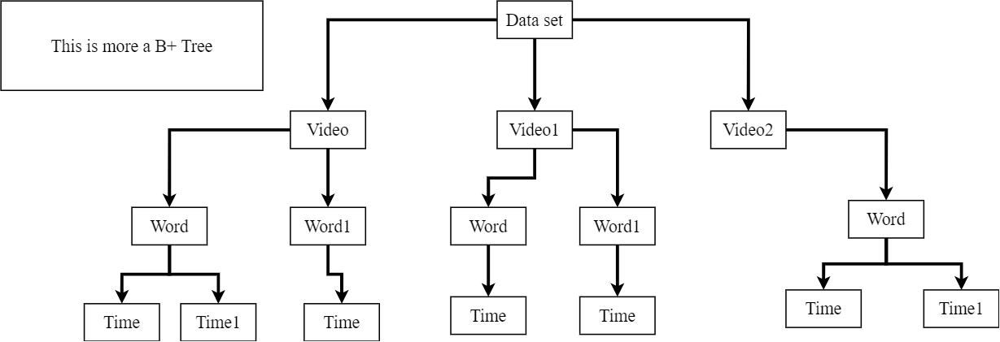
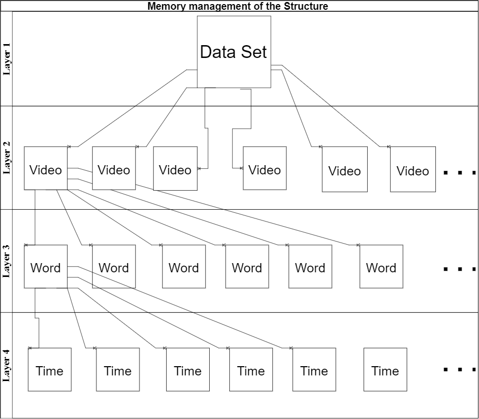

# Automated-Data-Minin-System

---

## Overview

This project is using Spring Boot 3.0 and Java 20.

<figure><figcaption>HashMap Logical Structure</figcaption></figure>

This figure (HashMap Logical Structure) represents the data structure that the program will construct in the preprocessing stage. The structure is simple, using the benefits of the HashMaps, O(1) time to search/get or insert an item. As I did in this project, the structure can be multiple layers for folders or subfolders. A better understanding of the structure is the figure (HashMap Layer View). Also, "Time" is a pair of timestamps; the first will be the starting point, and the other will be the finishing time.

<figure><figcaption>HashMap Layer View</figcaption></figure>

---

## Performance

This project was more towards to the performance of the preporcess and processing stage, hence the time and memory optimisation is quite impressing, as it can be seen in the figure (Memory Optimisation) and in the figure (Time Optimisation). In both figures two datasests were tested, Check and LRW (an well known lip reading dataset form Oxford). Moreover the memory is measured in GB and the time is measured in seconds.

<figure><figcaption>Memory Optimisation</figcaption></figure>

In the above figure (Memory Optimisation) can be seen as a significant reduction, 98% reduction, between the original size, the "Pre-processed" size and the "HashMap" size.

* The "Pre-processed" size is the dataset with all information, the hashmap that can be reused for more statistics analysis and the statistics analysis that the program has done during the runtime.
* The "HashMap" size is the data size of the hashmap generated in the "Pre-process" stage. Moreover, The size that is specified in the worst case ( You have 1 dataset, 1 folder, 1 video) since the program is optimised in a way that will load each folder one by one and it will drop it from the memory when it is not used anymore

<figure><figcaption>Time Optimisation</figcaption></figure>

The above figure (Time Optimisation) showcases the program's effective time to run and some memory comparisons again. For 0.0015 GB, the program runs in 0.056 seconds, and for 46.1 GB, the program runs in 11.417 seconds. The program uses multithreading and allocates as many resources as are available on the system at that time. Furthermore, it uses parallel processing using docker; if two or more datasets are needed to be processed, then there can be two different instances of the docker container that contains this application, and both can be terminated when there is no more job for them. Moreover, the program is in a Spring Boot application. Hence, it can be virtualised and deployed anywhere, and communication can be done through the network.

---

## How to run

1. You can download the code after you ask the author (the author will give a few more guidelines afterwards), download any Java 20+, and create two different folders, one called "Common_Shared_Volume" and the other one called "Shared_Volume" (the second one is needed if and only if you need to use multiple containers at the same time).
2. You can download the applications from the Docker Hub after you ask the author for access  (the author will give a few more guidelines afterwards).
