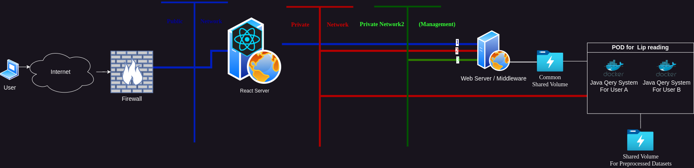
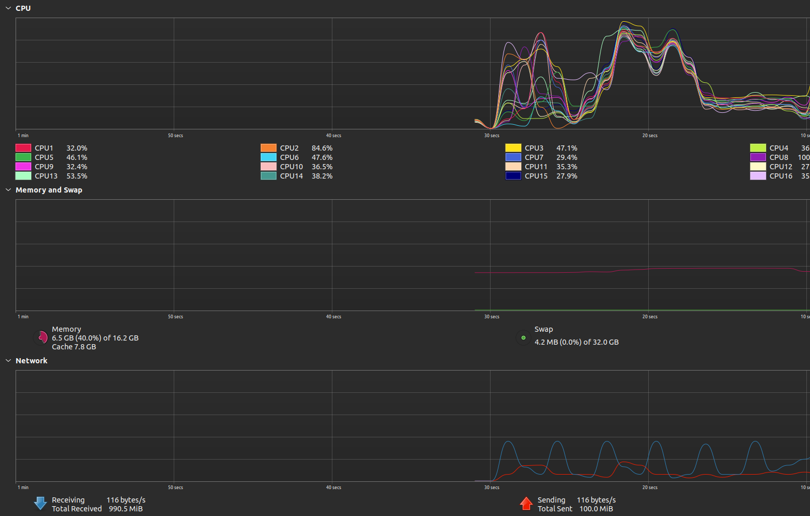
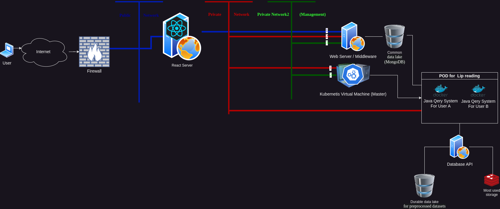

# Dissertation

This is my final year project (dissertation), this will have two parts, the current state and the state that I would like to achive.

This project has three main components: 

* Web application with React and Material UI to provide a graphical interface through which the users will be able to visualize the dataset analysis

* Middleware, a Spring Boot application with Java 19, must handle the UI requests and will create, destroy, and communicate with diverse containers that virtualize the third component.

* Spring Boot application that will analyze the diverse datasets. In this case, it is focused more on the lip reading datasets.

-------------------------------------------

## State of the application

<figure><figcaption>Abstract overview of the project (First Stage)</figcaption></figure>

In this state of the application I was more focused on the performance and creating the platform that can be further developed in the future. This aspect can be seen in the next figure (Performance):

<figure><figcaption>Performance</figcaption></figure>

From the perfromance point a view the system is blazingly fast and also has a good memory management, in less than 12 seconds, 11.07 seconds, preporcessed and analised 46.1 GB of data with almost constant memory resources. Moreover, from 46.1 GB from the dataset, after the preporcessed and the result where 0.07 GB. Furthermore, only 0.01 GB will be needed for a further analisys. More in the Automated-Data-Mini-System submodule.  

In this scenario the kubernetes was not neceserly and it was not beeing involved.

### Tests

There were some tests that have been done, integretion, smoke, unit, performance testing.

One way that I have test it was through Postman, since it can tell the efective time took for the system to response and the amount of memory that response come along with for each request.  

<figure><figcaption>Testing platform</figcaption></figure>

System specifications:

<table>

<tr>
    <th>Processor</th>
    <td>AMD Ryzen 7 4800H with Radeon Graphics 2.90 GHz</td>
</tr>
<tr>
    <th>GPU</th>
    <td>NVIDIA GeForce GTX 1650</td>
</tr>
<tr>
    <th>RAM</th>
    <td>16.0 GB DDR4</td>
</tr>
<tr>
    <th>SSD</th>
    <td>512GB PCIE G3</td>
</tr>

</table>

----------------------------------------------------------

## Final plan

<figure><figcaption>Abstract Overview Goal</figcaption></figure>

This is what I want to achive in the final stage of the project. 

The difference between this state of the application and the previous one is the fact that the volumes are now NoSQL databases, as MongoDB, that will be used as a data lake. Moreover, the application is compatible with CDN arhitecture and the Kubernetes will be more pivotal in this arhitecture. Furthermore, the most used database in this case will be Redis for fast read and write.
